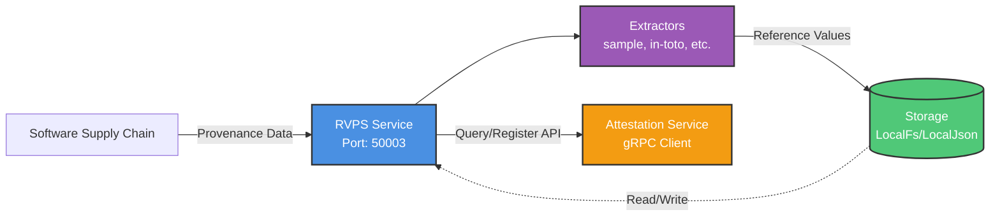

# RVPS (Reference Value Provider Service) Packaging Analysis

**Last Updated:** 2025-10-14<br>
**Analyzed Version:** commit 42f5c66 (main branch)<br>
**Component:** RVPS (Reference Value Provider Service)<br>
**Target Distributions:** Fedora 42 and RHEL 10.2

## 1. Summary

This document provides a detailed technical analysis of the RVPS (Reference Value Provider Service) component for packaging as an RPM for Fedora and RHEL distributions. RVPS is a standalone service that receives, verifies, and stores software supply chain provenances/metadata, providing reference values to the Attestation Service for evidence verification.

**Key Characteristics:**
- **Package name:** `reference-value-provider-service` (crate name)
- **Binary names:** `rvps` (service), `rvps-tool` (client)
- **Language:** Rust (edition 2021)
- **Default port:** 50003 (gRPC)
- **Storage backends:** LocalFs, LocalJson
- **Can run standalone:** Yes (independent of KBS/AS)

---

## 2. Component Overview

### 2.1 Purpose

RVPS acts as a reference value database for confidential computing attestation:

1. **Receives** provenance data from software supply chains
2. **Verifies** the authenticity and integrity of provenances
3. **Extracts** reference values (expected measurements) from verified provenances
4. **Stores** reference values in persistent storage
5. **Provides** reference values to Attestation Service via gRPC API

### 2.2 Architecture



**Components:**
- **Extractors:** Process different provenance types (sample, in-toto, etc.)
- **Storage:** Key-value store for reference values
- **gRPC Server:** API for registering and querying reference values (port 50003)

### 2.3 Deployment Modes

1. **Standalone Service (Recommended for Packaging):**
   - Runs as independent gRPC service on port 50003
   - Attestation Service connects via gRPC
   - Enables separate scaling and management

2. **Native Mode (Not Recommended):**
   - Compiled as library into Attestation Service
   - No separate process
   - Less flexible

**For RPM packaging, we target the standalone service mode.**

---

## 3. Build Dependencies

### 3.1 System-Level Dependencies

| Dependency             | Required Version | Available in Fedora 42 | Available in RHEL 10.2 | Notes                                         |
| ---------------------- | ---------------- | ---------------------- | ---------------------- | --------------------------------------------- |
| `rust`                 | >= 1.70          | ✅ Yes (1.90.0)        | ✅ Yes (1.89.0)        | Rust compiler.                                |
| `cargo`                | >= 1.70          | ✅ Yes (1.90.0)        | ✅ Yes (1.89.0)        | Rust package manager.                         |
| `gcc`                  | >= 7.0           | ✅ Yes (15.2.1)        | ✅ Yes (14.3.1)        | C compiler for native dependencies.           |
| `make`                 | Any              | ✅ Yes (4.4.1)         | ✅ Yes                 | Build system (RVPS has Makefile).             |
| `protobuf-compiler`    | >= 3.15          | ✅ Yes (3.19.6)        | ✅ Yes (3.19.6)        | **Required** for gRPC code generation.        |
| `git`                  | Any              | ✅ Yes (2.51.0)        | ✅ Yes                 | Needed by shadow-rs for version info.         |

**Note:** RVPS does NOT require `openssl-devel` at build time (unlike KBS/AS). It has minimal system dependencies.

### 3.2 Optional Build Dependencies

| Dependency             | Required For            | Available              | Notes                                         |
| ---------------------- | ----------------------- | ---------------------- | --------------------------------------------- |
| `golang`               | `in-toto` feature       | ✅ Yes                 | Only if building with in-toto provenance support (experimental, not default). |

**Recommendation:** Do NOT enable `in-toto` feature for initial packaging. It requires Go toolchain and CGO bindings.

### 3.3 Rust Crate Dependencies

RVPS has relatively lightweight dependencies compared to KBS/AS:

**Core Dependencies:**
- `anyhow`: Error handling
- `async-trait`: Async traits
- `serde`, `serde_json`: Serialization
- `log`: Logging

**gRPC Dependencies (required for `bin` feature):**
- `prost` (0.13): Protocol Buffers runtime
- `tonic` (0.12): gRPC framework
- `tokio` (1.x): Async runtime

**Storage Dependencies:**
- `sled` (0.34.7): Embedded key-value database
- `roxmltree` (0.20.0): XML parsing (for some provenance types)

**Build-time Dependencies:**
- `shadow-rs` (1.3.0): Build-time metadata (git hash, version, build date)
- `tonic-build` (0.12): gRPC code generation from `.proto` files

**Total Crate Count:** ~30-40 (significantly fewer than KBS's 200+)

---

## 4. Runtime Dependencies

### 4.1 System Libraries

| Dependency             | Required Version | Available in Fedora 42 | Available in RHEL 10.2 | Notes                               |
| ---------------------- | ---------------- | ---------------------- | ---------------------- | ----------------------------------- |
| `glibc`                | >= 2.31          | ✅ Yes (2.41)          | ✅ Yes (2.39)          | Standard C library. Rust requires relatively recent glibc. |
| `libgcc`               | >= 7.0           | ✅ Yes (15.2.1)        | ✅ Yes (14.3.1)        | GCC runtime library.                |

**Note:** RVPS does NOT depend on `openssl-libs` at runtime. It uses pure-Rust implementations for all functionality.

### 4.2 Network Requirements

- **Default Listen Address:** `127.0.0.1:50003`
- **Protocol:** gRPC (HTTP/2)
- **Firewall:** May need to open port 50003 if AS runs on different host

### 4.3 Storage Requirements

- **Default Storage Path:** `/opt/confidential-containers/attestation-service/reference_values`
- **Storage Type:** Filesystem directory (LocalFs) or single JSON file (LocalJson)
- **Space Requirements:** Depends on number of reference values (typically < 100 MB)

---

## 5. Feature Flags

RVPS uses Cargo feature flags to control which functionality is compiled:

### 5.1 Default Features

```toml
default = [ "bin" ]
```

**Feature: `bin`**
- Enables: `clap`, `config`, `env_logger`, `prost`, `shadow-rs`, `tokio`, `tonic`
- Builds: `rvps` and `rvps-tool` binaries
- **Required for RPM packaging**

### 5.2 Optional Features

**Feature: `in-toto`**
- Enables: `path-clean`, `sha2`
- Adds: Support for in-toto provenance format
- **Requires:** Go compiler (for CGO bindings)
- **Status:** Experimental, not ready for production
- **Recommendation:** Do NOT enable for initial packaging

**Feature: `rebuild-grpc-protos`**
- Triggers: Re-generation of gRPC code from `.proto` files
- **Only needed:** When modifying protobuf definitions
- **Recommendation:** Do NOT enable (use pre-generated code)

### 5.3 Recommended Build Configuration

```bash
# Standard build with default features
cargo build --release -p reference-value-provider-service

# Or via Makefile
make -C rvps build
```

**Features enabled:** `bin` (default)
**Features disabled:** `in-toto`, `rebuild-grpc-protos`

---

## 6. Build Process

### 6.1 Standard Build

```bash
cd rvps
make build
```

This executes:
```bash
cargo build --release --features bin
```

**Output binaries:**
- `../target/release/rvps` - Main service
- `../target/release/rvps-tool` - Client tool

### 6.2 Build Script (`build.rs`)

The `rvps/build.rs` script performs:

1. **Shadow-rs integration:** Captures build metadata (git commit, build date, version)
2. **Protobuf compilation (if `rebuild-grpc-protos`):** Generates Rust code from `../protos/reference.proto`
3. **CGO compilation (if `in-toto`):** Builds Go code into static library

**For standard packaging:** Only shadow-rs runs. No protobuf regeneration, no Go compilation.

### 6.3 Installation

```bash
make -C rvps install
```

Default install destination: `/usr/local/bin/`
Override with: `DESTDIR=/usr/bin make -C rvps install`

---

## 7. Configuration

### 7.1 Configuration File Format

RVPS uses JSON configuration (passed via `-c` flag):

```json
{
    "storage": {
        "type": "LocalFs",
        "file_path": "/var/lib/trustee/rvps/reference_values"
    }
}
```

**Configuration Fields:**

| Field                | Type   | Default                                                             | Description                          |
| -------------------- | ------ | ------------------------------------------------------------------- | ------------------------------------ |
| `storage.type`       | String | `LocalFs`                                                           | Storage backend (`LocalFs` or `LocalJson`) |
| `storage.file_path`  | String | `/opt/confidential-containers/attestation-service/reference_values` | Directory (LocalFs) or file (LocalJson) path |

### 7.2 Command-Line Options

**`rvps` binary:**
```bash
rvps [OPTIONS]

Options:
  -c, --config <FILE>      Path to configuration file (JSON)
  --address <ADDR>         Listen address (default: 127.0.0.1:50003)
  -h, --help               Print help
  -V, --version            Print version
```

**`rvps-tool` binary:**
```bash
rvps-tool <COMMAND>

Commands:
  register    Register provenance into RVPS
  query       Query reference values from RVPS
  help        Print help

Options:
  -h, --help       Print help
  -V, --version    Print version
```

### 7.3 Environment Variables

No specific environment variables required. All configuration via:
1. Configuration file (`-c` flag)
2. Command-line arguments

---

## 8. Proposed RPM Package Layout

### 8.1 Package Name: `trustee-rvps`

**Binaries:**
- `/usr/bin/rvps`
- `/usr/bin/rvps-tool`

**Systemd Unit:**
- `/usr/lib/systemd/system/trustee-rvps.service`

**Configuration:**
- `/etc/trustee/rvps.json` (default config, marked as `%config(noreplace)`)

**Data Directory:**
- `/var/lib/trustee/rvps/` (storage location)
  - Owner: `trustee:trustee`
  - Permissions: `0750`

**Documentation:**
- `/usr/share/doc/trustee-rvps/README.md`
- `/usr/share/doc/trustee-rvps/examples/` (example config, sample provenance messages)

**License:**
- `/usr/share/licenses/trustee-rvps/LICENSE`

---

## 9. Systemd Service Configuration

### 9.1 Proposed Service File: `trustee-rvps.service`

```ini
[Unit]
Description=Trustee Reference Value Provider Service (RVPS)
Documentation=https://github.com/confidential-containers/trustee/tree/main/rvps
After=network-online.target
Wants=network-online.target

[Service]
Type=simple
User=trustee
Group=trustee
ExecStart=/usr/bin/rvps --config /etc/trustee/rvps.json --address 0.0.0.0:50003
Restart=on-failure
RestartSec=5s

# Security hardening
NoNewPrivileges=true
PrivateTmp=true
ProtectSystem=strict
ProtectHome=true
ReadWritePaths=/var/lib/trustee/rvps
ProtectKernelTunables=true
ProtectKernelModules=true
ProtectControlGroups=true
RestrictRealtime=true
RestrictNamespaces=true
LockPersonality=true
MemoryDenyWriteExecute=true
RestrictAddressFamilies=AF_UNIX AF_INET AF_INET6

# Logging
StandardOutput=journal
StandardError=journal
SyslogIdentifier=rvps

[Install]
WantedBy=multi-user.target
```

### 9.2 Service Management

```bash
# Enable and start
systemctl enable --now trustee-rvps

# Status
systemctl status trustee-rvps

# Logs
journalctl -u trustee-rvps -f
```

---

## 10. User and Group Management

### 10.1 System User Creation

The `trustee-rvps` package should create a system user in the `%pre` scriptlet:

```bash
%pre
getent group trustee >/dev/null || groupadd -r trustee
getent passwd trustee >/dev/null || \
    useradd -r -g trustee -d /var/lib/trustee -s /sbin/nologin \
    -c "Trustee service account" trustee
exit 0
```

**User Details:**
- Username: `trustee`
- Group: `trustee`
- Home: `/var/lib/trustee`
- Shell: `/sbin/nologin` (no login)
- Type: System account (`-r` flag)

**Rationale:** Use shared `trustee` user across all Trustee components (KBS, AS, RVPS) for simplicity.

---

## 11. Risks and Considerations

### 11.1 Build-Time Risks

| Risk                          | Severity | Mitigation                                                   |
| ----------------------------- | -------- | ------------------------------------------------------------ |
| **Protobuf version compatibility** | None ✅   | Both Fedora 42 and RHEL 10.2 have identical version 3.19.6, which meets tonic-build >= 3.15 requirement. Verified on both systems. |
| **Network access during build** | High 🔴  | **MUST vendor all Rust dependencies** using `cargo vendor` before packaging. Standard for Fedora Rust packages. |
| **in-toto feature complexity** | Medium ⚠️ | **Do NOT enable** `in-toto` feature. Requires Go toolchain and is experimental. |

### 11.2 Runtime Risks

| Risk                          | Severity | Mitigation                                                   |
| ----------------------------- | -------- | ------------------------------------------------------------ |
| **Port conflicts (50003)**     | Low ℹ️   | Document default port. Config file allows override. Consider using higher port (e.g., 50003 is in ephemeral range on some systems). |
| **Storage directory permissions** | Medium ⚠️ | Ensure `/var/lib/trustee/rvps/` owned by `trustee:trustee` with mode `0750`. SELinux context may be needed. |
| **gRPC communication security** | Medium ⚠️ | RVPS currently does NOT support TLS. Communication with AS should be on localhost or trusted network. Document security considerations. |
| **Storage corruption**         | Low ℹ️   | `sled` database is crash-safe but not multi-process safe. Ensure only one RVPS instance writes to same storage. |

### 11.3 Packaging Risks

| Risk                          | Severity | Mitigation                                                   |
| ----------------------------- | -------- | ------------------------------------------------------------ |
| **Dependency count**          | Low ✅   | RVPS has ~30-40 crates (much less than KBS). Vendoring should be straightforward. |
| **Binary size**               | Low ℹ️   | `rvps` binary ~8-12 MB, `rvps-tool` ~6-8 MB. Acceptable for modern systems. |
| **SELinux policy**            | Medium ⚠️ | May need custom policy for file contexts (`/var/lib/trustee/rvps/`) and network ports (50003). Test on enforcing mode. |

---

## 12. Testing Checklist

Before submitting package:

- [ ] **Build succeeds** in mock environment with vendored dependencies
- [ ] **Binaries execute:** `rvps --version`, `rvps-tool --version` work
- [ ] **Service starts:** `systemctl start trustee-rvps` succeeds
- [ ] **Service listens:** Port 50003 is open (`ss -tlnp | grep 50003`)
- [ ] **Basic functionality:**
  - [ ] Register sample provenance with `rvps-tool register`
  - [ ] Query reference values with `rvps-tool query`
  - [ ] Verify values stored in `/var/lib/trustee/rvps/`
- [ ] **Permissions correct:**
  - [ ] `/var/lib/trustee/rvps/` owned by `trustee:trustee`, mode `0750`
  - [ ] Binaries in `/usr/bin/` executable by all
- [ ] **SELinux enforcing:** No denials in audit log
- [ ] **Service restart:** `systemctl restart trustee-rvps` works without data loss
- [ ] **Logging:** Logs appear in `journalctl -u trustee-rvps`
- [ ] **Upgrade:** Package upgrade preserves configuration and data
- [ ] **Uninstall:** Package removal cleans up (except data directory)

---

## 13. Integration with Attestation Service

### 13.1 AS Configuration for Remote RVPS

When packaging, ensure documentation includes example AS config for gRPC RVPS:

```json
{
    "work_dir": "/var/lib/trustee/attestation-service/",
    "rvps_config": {
        "type": "GrpcRemote",
        "address": "127.0.0.1:50003"
    }
}
```

### 13.2 Network Communication

```
Attestation Service (client) --gRPC--> RVPS (server :50003)
```

**Security Note:** If AS and RVPS run on different hosts, consider:
- Using firewall rules to restrict access
- Running AS and RVPS on same host with `127.0.0.1` binding
- Future: TLS support (not currently available)

---

## 14. Example RPM Spec Snippet

### 14.1 Package Metadata

```spec
Name:           trustee-rvps
Version:        0.1.0
Release:        1%{?dist}
Summary:        Reference Value Provider Service for Trustee

License:        Apache-2.0
URL:            https://github.com/confidential-containers/trustee
Source0:        trustee-%{version}.tar.gz
Source1:        vendor.tar.gz
Source2:        trustee-rvps.service

BuildRequires:  rust >= 1.70
BuildRequires:  cargo >= 1.70
BuildRequires:  gcc
BuildRequires:  protobuf-compiler >= 3.15
BuildRequires:  git
BuildRequires:  systemd-rpm-macros

Requires:       glibc
Requires(pre):  shadow-utils
Requires(post): systemd
Requires(preun): systemd
Requires(postun): systemd

%description
RVPS (Reference Value Provider Service) receives software supply chain
provenances, verifies them, and provides reference values to the
Attestation Service for confidential computing attestation workflows.
```

### 14.2 Build Section

```spec
%prep
%autosetup -n trustee-%{version} -p1
%cargo_prep -v vendor

%build
cd rvps
cargo build --release --locked --offline

%install
# Install binaries
install -D -m 0755 target/release/rvps %{buildroot}%{_bindir}/rvps
install -D -m 0755 target/release/rvps-tool %{buildroot}%{_bindir}/rvps-tool

# Install systemd unit
install -D -m 0644 %{SOURCE2} %{buildroot}%{_unitdir}/trustee-rvps.service

# Install default config
install -D -m 0644 rvps/examples/config.json %{buildroot}%{_sysconfdir}/trustee/rvps.json

# Create data directory
install -d -m 0750 %{buildroot}%{_sharedstatedir}/trustee/rvps
```

### 14.3 Scriptlets

```spec
%pre
getent group trustee >/dev/null || groupadd -r trustee
getent passwd trustee >/dev/null || \
    useradd -r -g trustee -d %{_sharedstatedir}/trustee -s /sbin/nologin \
    -c "Trustee service account" trustee
exit 0

%post
%systemd_post trustee-rvps.service

%preun
%systemd_preun trustee-rvps.service

%postun
%systemd_postun_with_restart trustee-rvps.service

%files
%license LICENSE
%doc rvps/README.md
%{_bindir}/rvps
%{_bindir}/rvps-tool
%{_unitdir}/trustee-rvps.service
%config(noreplace) %{_sysconfdir}/trustee/rvps.json
%dir %attr(0750,trustee,trustee) %{_sharedstatedir}/trustee
%dir %attr(0750,trustee,trustee) %{_sharedstatedir}/trustee/rvps
```

---

## 15. Open Questions

1. **SELinux Policy:**
   - Does RVPS need a custom SELinux policy module?
   - What file contexts should be set for `/var/lib/trustee/rvps/`?
   - Does port 50003 need specific SELinux labeling?

2. **TLS Support:**
   - Should we request upstream to add TLS support for gRPC?
   - For now, recommend localhost-only deployment?

3. **Multi-Architecture:**
   - RVPS is pure Rust with no architecture-specific code
   - Should we support x86_64, aarch64, s390x, ppc64le?
   - **Recommendation:** Support all Fedora architectures (no limitations)

4. **Storage Backend:**
   - Should we package with only `LocalFs` support?
   - Is `LocalJson` needed for specific use cases?
   - **Current:** Both are built-in, controlled by config file

5. **Log Rotation:**
   - RVPS logs to systemd journal
   - Is journal retention sufficient, or should we configure logrotate?

6. **Health Check Endpoint:**
   - RVPS gRPC API doesn't expose health check endpoint
   - Should systemd use `Type=notify` with sd_notify support?
   - **Current:** `Type=simple` with process monitoring

---

## 16. Comparison with KBS and AS

| Aspect                  | RVPS                   | KBS                    | AS                     |
| ----------------------- | ---------------------- | ---------------------- | ---------------------- |
| **Build Complexity**    | Low ✅                 | High                   | Medium                 |
| **Rust Crate Count**    | ~30-40                 | ~200+                  | ~80-100                |
| **OpenSSL Dependency**  | No ✅                  | Yes                    | Yes                    |
| **Feature Flags**       | 2 (simple)             | 10+ (complex)          | 15+ (complex)          |
| **Binary Size**         | ~10 MB                 | ~50 MB                 | ~30 MB                 |
| **Runtime Deps**        | glibc only ✅          | glibc, openssl-libs    | glibc, openssl-libs    |
| **Config Format**       | JSON                   | TOML/JSON/YAML         | JSON                   |
| **Default Port**        | 50003 (gRPC)           | 8080 (HTTP)            | 50004 (gRPC)           |
| **Packaging Priority**  | Medium (dependency)    | High (main component)  | High (main component)  |

**RVPS Advantages for Packaging:**
- Simpler build (no OpenSSL linking issues)
- Fewer dependencies to vendor
- No architecture-specific code
- Smaller binary size

---

## 17. References

- **Upstream RVPS Documentation:** `rvps/README.md` in repository
- **gRPC Protocol Definition:** `protos/reference.proto`
- **Sled Database:** https://docs.rs/sled/
- **Tonic (gRPC):** https://docs.rs/tonic/
- **Fedora Rust Packaging:** https://docs.fedoraproject.org/en-US/packaging-guidelines/Rust/

---

## 18. Changelog

| Date       | Changes                                      |
| ---------- | -------------------------------------------- |
| 2025-10-14 | Initial RVPS-specific packaging analysis     |
| 2025-10-14 | Updated with verified RHEL 10.2 Beta package versions |

---

**End of Document**
